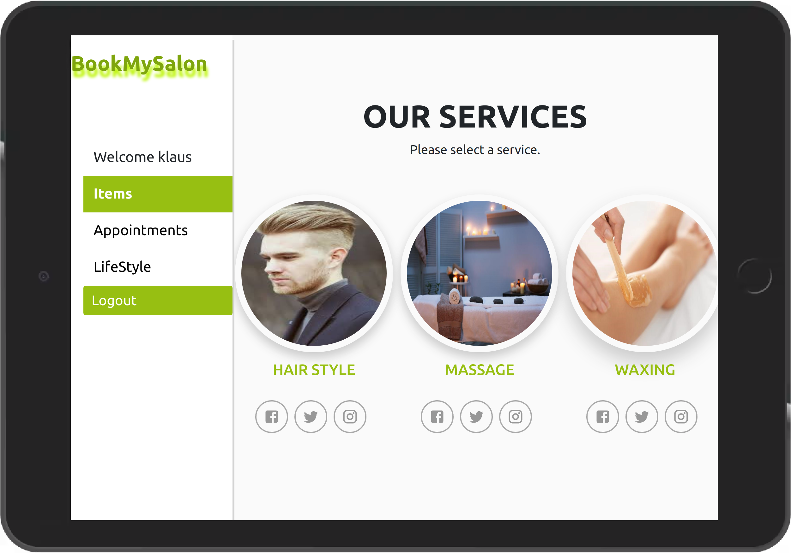

# Salon Book Appointments App: BookMySalon

## About the Project
BookMySalon is a web application built with React and Redux. The main goal for this project was to build a website similar to the Book Appointment App by following the given [design](https://www.behance.net/gallery/26425031/Vespa-Responsive-Redesign). 
I also built [REST API with Ruby on Rails](https://github.com/Div685/Book-Appointment-API) as the back-end for this application.

In this app, users can check different services and book an appointment with their preferable branch and time to use that service.

I've implemented the following functionality:
- Connected to the back-end API to send and receive data
- With routes for each of the screens, so the user can easily go back and forward
- Use Redux to store info used across the app, like the username
- The project has been deployed to Heroku and accessible online
- Implemented user authentication from the front-end to the server
- Made the app responsive, creating both tablet and desktop versions, following design guidelines.

## Built With

* [React](https://reactjs.org/)
* [Redux](https://redux.js.org/)
* [JavaScript](https://en.wikipedia.org/wiki/JavaScript)
* HTML5
* CSS3

## Live Demo

[Live Demo Link](https://salon-appointment-33fe4.web.app/)

## Getting Started

To get a local copy up and running, follow these simple example steps.

- [ ] On the project GitHub page, navigate to the main page of the repository.
- [ ] Under the repository name, locate and click on a green button named `Code`. 
- [ ] Copy the project URL as displayed.
- [ ] Navigate to the directory where you will like to install the repo by running `cd FOLDER-NAME`
- [ ] Type git clone, and then paste the URL you copied.  
e.g. `$ git clone https://github.com/Div685/Salon-Appointments.git`
7. Press Enter. Your local copy will be created. 
8. Go to api/apiUrl.js and rewrite the baseUrl like `http://localhost:3001/` so you can run this project in your local environment
9. To run the server, run `npm start`
10. To run the tests, run `npm test`

## How to use this app as a user

1. To start using this app as a user, you need to log in with a username and password. The login is authenticated by an API
2. Then, The main page will show you the lists of services we offer, and you can select any one of them.
3. After Selecting, you can see the details about the service, and you can book an appointment for that service with us.
4. On the left side of the screen, you will see the different options and by clicking on the Appointments option you can be able to track your appointments.

## How to manage items as an admin user

1. Like the ordinary user, you need to log in with a username and password as an admin user, which is required to be given the status of admin: true by the administrator for the API
  * You can see how to create an admin user in the [Readme file for the REST API](https://github.com/Div685/Book-Appointment-API)
2. Then, you'll see the admin page.
> Note: There is no admin User for now in the database therefore, you will not be able to login or create an admin. I will surely add an admin panel in the coming future. The above description about the Admin user is to give you the idea and the knowledge about the admin user and its role.

## Author

👤 **Mian Faizan Ali Full Stack Programmer**

- GitHub: [@Faizanalifullstackprogrammer](https://github.com/Faizanalifullstackprogrammer)
- Twitter: [@mianfaizanali](https://twitter.com/mianfaizanali)
- LinkedIn: [Mianfaizanali](https://pk.linkedin.com/in/mianfaizanali)

## 🤝 Contributing

Contributions, issues, and feature requests are welcome!

Feel free to connect anytime

## Contributing

Contributions, issues, and feature requests are welcome!
Feel free to check the [issues page](../../issues).

1. Fork the Project
2. Create your Feature Branch (`git checkout -b feature/AmazingFeature`)
3. Commit your Changes (`git commit -m 'Add some AmazingFeature'`)
4. Push to the branch (`git push origin feature/AmazingFeature`)
5. Open a Pull Request

## Show your support

Give an ⭐️ if you like this project!

## License

### Design:
["Vespa - Responsive Redesign "](https://www.behance.net/gallery/26425031/Vespa-Responsive-Redesign) design idea by [Murat Korkmaz](https://www.behance.net/muratk).

### Application:
This project is [MIT](./LICENSE) licensed except for the design above

## Acknowledgements
* [Murat Korkmaz](https://www.behance.net/muratk) for the wonderful design idea and Behance.net for the providing platform to access the wonderful [design](https://www.behance.net/gallery/26425031/Vespa-Responsive-Redesign)
* [Proptypes](https://reactjs.org/docs/typechecking-with-proptypes.html)
* [axios](https://github.com/axios/axios)
